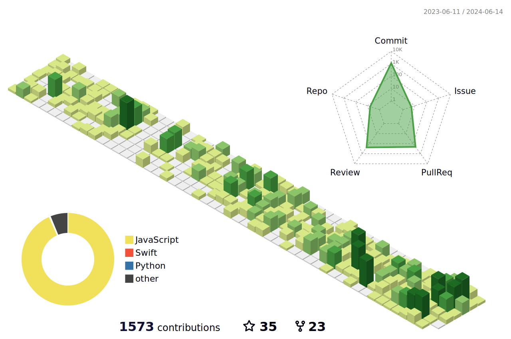

## 👨‍🎓
- 인하공업전문대학 컴퓨터정보과
  - **제 35대 부학회장**
  - **제 36대 학회장**
  - **학생자치운영위원회 복지부장**
- 한양대학교 인공지능융합학과

## 🏆
- **제 7회 K-Hackathon** - 소프트웨어 교육혁신센터 이사장상
- **제 6회 소프트웨어 개발보안 경진대회** - 한국인터넷 진흥원장상(KISA)
- **2021 경기도 온라인 메이커 경진대회** - 우수상
- **제 9회 소프트웨어 개발보안 경진대회** - 행정안전부 장관상

---
### 
- 📧 Email: [songhwee1@naver.com](mailto:songhwee1@naver.com)
- 📞 Phone: +82-10-5301-2022

---

---

